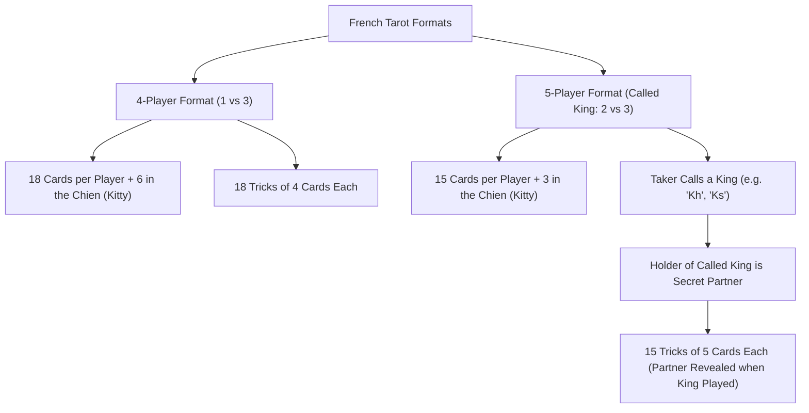

# Implementation Plan: French Tarot Game Notation (FTGN)

This document outlines the architectural specification and implementation plan for **French Tarot Game Notation (`FTGN` / `.ftgn` / `.ftgnb`)**, with full support for 78-card decks, 4-player (1 vs 3), and 5-player (Called King) game formats.

---

## 🏛️ French Tarot Core Characteristics

| Attribute | Specification |
| :--- | :--- |
| **Total Deck** | **78 Cards** (56 Suit Cards + 22 Triumphs/Atouts) |
| **Suit Cards (56)** | 4 Suits (Spades, Hearts, Diamonds, Clubs), 14 cards per suit: Ace (1), 2..10, Jack (J), Knight/Cavalier (C/V), Queen (Q), King (K) |
| **Suit Card Rank** | **King (Highest)** > Queen > Knight > Jack > 10 > 9 > 8 > 7 > 6 > 5 > 4 > 3 > 2 > **Ace (Lowest)** |
| **Triumphs / Atouts (22)** | Numbered `1` to `21` (where `1` is the *Petit* and `21` is the highest trump) + `0` (The Excuse / *L'Excuse*) |
| **Oudlers (Bouts)** | **21 of Trump**, **1 of Trump (Petit)**, and **The Excuse (0)** |
| **Total Card Points** | **91 Points** total per deal |
| **Contract Targets** | 0 Oudlers = 56 pts; 1 Oudler = 51 pts; 2 Oudlers = 41 pts; 3 Oudlers = 36 pts |

---

## 🎴 Game Formats: 4-Player vs 5-Player (Called King)



### 1. 4-Player Format (1 vs 3)
- **Players**: 4 players (Seats 0, 1, 2, 3).
- **Deal**: 18 cards per player (72 cards dealt) + 6 cards in the **Chien** (Kitty).
- **Tricks**: 18 tricks of 4 cards each.

### 2. 5-Player Format (Called King / *Appel au Roi*)
- **Players**: 5 players (Seats 0, 1, 2, 3, 4).
- **Deal**: 15 cards per player (75 cards dealt) + 3 cards in the **Chien** (Kitty).
- **Called King Mechanic**:
  - Before taking the Chien, the Taker must call a King (e.g. King of Hearts `Kh`).
  - The player holding the Called King becomes the **Secret Partner**.
  - If the Taker holds all 4 Kings, they can call a Queen (`Q`).
  - If the Called King is in the Chien, the Taker plays alone (1 vs 4).
  - The Secret Partner's identity becomes public to the table when the Called King is played in a trick.
- **Tricks**: 15 tricks of 5 cards each.

---

## 📄 `FTGN` JSON Schema Specification

```typescript
export interface FrenchTarotGameFile {
  fileType: "French Tarot Game Notation";
  version: "1.0";
  metadata: {
    gameId: string;
    title?: string;
    date?: string;
    players: [string, string, string, string] | [string, string, string, string, string];
    initialScore?: number[];
    ruleset: FrenchTarotRuleset;
  };
  deals: Array<{
    dealNumber: number;
    initialState: {
      dealer: number;
      chien: string[]; // 6 cards (4-player) or 3 cards (5-player)
      playerCards?: string[][];
    };
    phases: Array<FrenchTarotBiddingPhase | FrenchTarotPlayPhase>;
  }>;
}

export interface FrenchTarotBiddingPhase {
  phaseNumber: 0;
  type: "TAROT_BIDDING";
  taker: number; // Seat index of taker (0..3 or 0..4)
  bid: "PRISE" | "GARDE" | "GARDE_SANS" | "GARDE_CONTRE";
  calledKing?: "Ks" | "Kh" | "Kd" | "Kc" | string | null; // Called King in 5-player format
  buriedChien?: string[]; // Cards buried in Chien by taker (if Prise or Garde)
  poignee?: Array<{ playerIndex: number; count: 10 | 13 | 15; trumps: string[] }>;
  chelem?: { announcedBy: number; achieved: boolean };
}

export interface FrenchTarotPlayPhase {
  phaseNumber: 1;
  type: "TRICK_PLAY";
  tricks: Array<string[]>; // 18 tricks of 4 cards (4-player) or 15 tricks of 5 cards (5-player)
  playAnnotations?: Record<string, string[]>;
}

export interface FrenchTarotRuleset {
  variant?: "4_PLAYER" | "5_PLAYER_CALLED_KING" | "3_PLAYER";
  kings_high_aces_low?: boolean; // Always true (Kings = highest suit card, Aces = lowest)
  red_suits_reverse_pip_order?: boolean; // Default: false (modern FFT). If true (traditional Tarot), red suit pips rank Ace > 2 > 3 ... > 10
  petit_at_end_bonus?: number; // 10 points bonus if Petit (1 of Trump) won in last trick
}
```

---

## 📦 `FTGN` Bitpacker Specification (`.ftgnb`)

- **78-card Deck Mapping**: 7 bits per card (`0`..`77`).
  - Cards 0..55: Suit cards (`2s`..`Ks`, `2h`..`Kh`, `2d`..`Kd`, `2c`..`Kc`).
  - Cards 56..77: Triumphs (`T0` Excuse, `T1` Petit .. `T21`).
- **Player Hands**:
  - 4-Player: 4 * 18 cards * 7 bits = 504 bits.
  - 5-Player: 5 * 15 cards * 7 bits = 525 bits.
- **Chien (Kitty)**: 3 to 6 cards * 7 bits = 21 to 42 bits.
- **Bidding Phase**: Taker seat (3 bits) + Bid type (2 bits) + Called King ID (7 bits).
- **Trick Play**:
  - 4-Player: 18 tricks * 4 cards * 7 bits = 504 bits.
  - 5-Player: 15 tricks * 5 cards * 7 bits = 525 bits.
- **Total Bitpacked Deal Size**: **~110 - 130 bytes** (vs ~30 KB raw JSON), achieving **~95% compression**.

---

## 🚀 Repository Roadmap & Integration

1. Add `French Tarot Game Notation` (`.ftgn` / `.ftgnb` / `.ftmn`) to `@tgn/core` polymorphic dispatcher.
2. Publish `french-tarot-game-notation` repository depending on `@tgn/core`.
3. Support 78-card hand layouts and 18-trick / 15-trick canvas playback in the unified Replayer UI.
