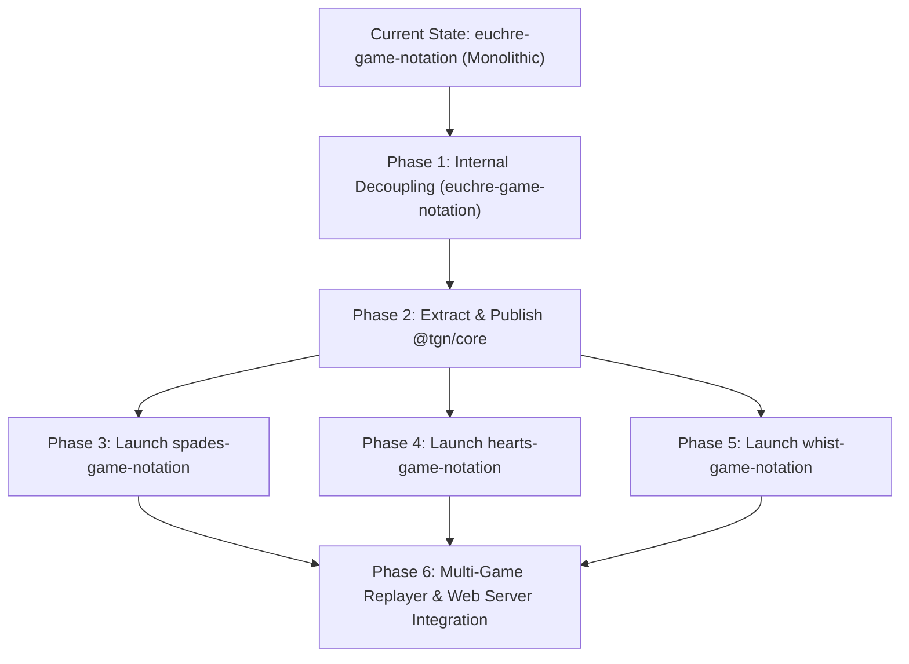

# Phased Migration Plan: Transitioning to Unified Multi-Game Notations

This document outlines the step-by-step roadmap for migrating from single-repo Euchre Game Notation to a modular, multi-game ecosystem supporting **Euchre (`EGN`)**, **Spades (`SGN`)**, **Hearts (`HGN`)**, and **Whist (`WGN`)**.

---

## 🧭 Architecture Migration Overview



---

## 📍 Phase 1: Internal Decoupling & Module Isolation (COMPLETE)(`euchre-game-notation`)

### Objectives
Refactor `euchre-game-notation` internally to isolate shared algorithms without breaking external API contracts.

### Action Items
1. **Extract Bitstream Utilities**: Move `BitWriter` and `BitReader` into `src/bitstream.ts`.
2. **Extract Hashing Utilities**: Move `stableStringify` and SHA-256 canonical hashing into `src/hashing.ts`.
3. **Isolate Card Parsing**: Move suit/rank card converters into `src/card-encoding.ts`.
4. **Isolate Generic Match Engine**: Extracted match series extraction (`extractGameFromMatch`, `extractAllGamesFromMatch`) into `src/match-engine.ts` using generic TypeScript generics (`GenericMatchFile<TGame>`, `GenericGameData`) with **zero EGN-specific references**, allowing EMN, SMN, HMN, WMN, SHMN, and FTMN to share identical match extraction logic.

### Verification & backward Compatibility
- Maintain 100% top-level re-exports in `src/index.ts`.
- Ensure all 300 existing unit tests pass without API breakage.

---

## 📍 Phase 2: Create & Publish Shared Core Package (`@tgn/core`)

### Objectives
Establish `@tgn/core` as the shared npm package dependency for all trick-taking game notation specifications.

### Action Items
1. Initialize repository `@tgn/core` (or `trick-taking-core`).
2. Move decoupled modules (`bitstream.ts`, `hashing.ts`, `card-encoding.ts`, `match-engine.ts`) into `@tgn/core`.
3. **Define Overarching Minimal TGN Base JSON Schema (`tgn-base-schema-v1.json`)**:
   Establish the base schema that `EGN`, `SGN`, `HGN`, and `WGN` extend:
   ```json
   {
     "$schema": "http://json-schema.org/draft-07/schema#",
     "title": "Trick-Taking Game Notation (TGN) Base Schema",
     "type": "object",
     "required": ["fileType", "version", "metadata", "deals"],
     "properties": {
       "fileType": {
         "type": "string",
         "enum": [
           "Euchre Game Notation",
           "Spades Game Notation",
           "Hearts Game Notation",
           "Whist Game Notation",
           "Trick-Taking Game Notation"
         ]
       },
       "version": { "type": "string", "pattern": "^1\\.[0-9]+$" },
       "metadata": {
         "type": "object",
         "required": ["gameId", "players"],
         "properties": {
           "gameId": { "type": "string" },
           "title": { "type": "string" },
           "date": { "type": "string" },
           "players": { "type": "array", "items": { "type": "string" }, "minItems": 2, "maxItems": 8 },
           "initialScore": { "type": "array", "items": { "type": "integer" } },
           "ruleset": { "type": "object" }
         }
       },
       "deals": {
         "type": "array",
         "items": {
           "type": "object",
           "required": ["dealNumber", "initialState", "phases"],
           "properties": {
             "dealNumber": { "type": "integer", "minimum": 0 },
             "initialState": {
               "type": "object",
               "required": ["dealer"],
               "properties": {
                 "dealer": { "type": "integer", "minimum": 0, "maximum": 7 }
               }
             },
             "phases": {
               "type": "array",
               "items": {
                 "type": "object",
                 "required": ["type"],
                 "properties": {
                   "phaseNumber": { "type": "integer", "minimum": 0 },
                   "type": { "type": "string" }
                 }
               }
             }
           }
         }
       }
     }
   }
   ```
4. **Define Base TypeScript Interfaces & Universal Dispatcher (`readTgnFile`)**:
   - `validateTgnBase(fileObj)` helper function.
   - `readTgnFile(input: string | Uint8Array)` polymorphic reader function that inspects `fileType` (JSON) or header enum (binary `.tgnb`) and dispatches to the registered game notation engine.
   - `ParsedTgnFile` root container interface.
   - `BaseDeal` and `BasePhase` interfaces.
   - `ITrickTakingEngine` interface contract.
5. **Publish `@tgn/core@1.0.0` to npm.**
6. Update `euchre-game-notation` to import shared utilities, extend `tgn-base-schema-v1.json`, and register with `readTgnFile`.

---

## 📍 Phase 3: Launch Spades Game Notation (`spades-game-notation`)

### Objectives
Create standalone specification and npm library for Spades (`.sgn` / `.sgnb` / `.smn`).

### Action Items
1. Create `spades-game-notation` repository depending on `@tgn/core`.
2. Define `sgn-schema-v1.json` (Spades JSON Schema) & generate `.proto` Protobuf schemas.
3. Implement Spades Bitpacker (`packDeal` / `unpackDeal` for 13-trick 52-card deals):
   - Encode 52-card hands (6 bits per card).
   - Encode Bidding Phase: 0..13 bids, `NIL`, `BLIND_NIL`.
   - Encode 13-trick play phase.
4. Implement Spades Match Notation (`.smn` / `.smnb`) combiner and extractor.
5. Add unit test suite (300+ tests including real-world `.sgn` example games).
6. Publish `spades-game-notation@1.0.0` to npm.

---

## 📍 Phase 4: Launch Hearts Game Notation (`hearts-game-notation`)

### Objectives
Create standalone specification and npm library for Hearts (`.hgn` / `.hgnb` / `.hmn`).

### Action Items
1. Create `hearts-game-notation` repository depending on `@tgn/core`.
2. Define `hgn-schema-v1.json` & Protobuf schemas.
3. Implement Hearts Passing Phase (`HEARTS_PASSING`):
   - Encode 3-card passes (Left, Right, Across, Keeper).
4. Implement Hearts 13-Trick Play Phase:
   - Track 2♣ initial lead requirement.
   - Track Queen of Spades (13 pts) and Hearts point penalties.
   - Implement "Shoot the Moon" score calculation logic.
5. Implement Hearts Match Notation (`.hmn` / `.hmnb`).
6. Publish `hearts-game-notation@1.0.0` to npm.

---

## 📍 Phase 5: Launch Whist Game Notation (`whist-game-notation`)

### Objectives
Create standalone specification and npm library for Whist variants (`.wgn` / `.wgnb` / `.wmn`).

### Action Items
1. Create `whist-game-notation` repository depending on `@tgn/core`.
2. Define `wgn-schema-v1.json` supporting multiple Whist variants:
   - **Classic Whist**: Dealer up-card trump determination.
   - **Solo Whist**: Proposal, Acceptance, Solo, Misere, Abundance bids.
   - **Minnesota Whist**: No-trump High/Low bidding (Aces high in High, Aces low in Low).
3. Implement Whist Bitpacker & Match Converters (`.wmn`).
4. Publish `whist-game-notation@1.0.0` to npm.

---

## 📍 Phase 6: Multi-Game Replayer & Web Server Integration

### Objectives
Upgrade Euchre Game Replayer web apps and backend services to seamlessly support Euchre, Spades, Hearts, and Whist.

### Action Items
1. Update Web Server Database Schemas:
   - Support `game_type` column (`"EUCHRE" | "SPADES" | "HEARTS" | "WHIST"`).
2. Update Replayer UI Components:
   - Import `@tgn/core` polymorphic game loader.
   - Dynamically render 5-trick canvas (Euchre) or 13-trick canvas (Spades/Hearts/Whist) based on `fileType`.
3. Support unified drag-and-drop file upload for `.egn`, `.sgn`, `.hgn`, `.wgn` files.

---

## 📅 Timeline Summary

| Phase | Milestone | Estimated Effort |
| :--- | :--- | :--- |
| **Phase 1** | Decouple `euchre-game-notation` modules | 1 - 2 Days |
| **Phase 2** | Publish `@tgn/core` shared library | 1 - 2 Days |
| **Phase 3** | Launch `spades-game-notation` | 3 - 5 Days |
| **Phase 4** | Launch `hearts-game-notation` | 3 - 5 Days |
| **Phase 5** | Launch `whist-game-notation` | 3 - 5 Days |
| **Phase 6** | Multi-Game Replayer UI & Server Integration | 4 - 6 Days |
