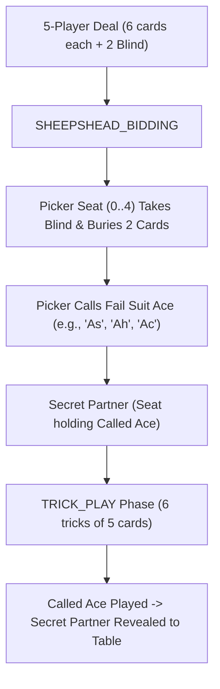

# Implementation Plan: Sheepshead Game Notation (SHGN) & 5-Player Mechanics

This document details the architectural specification and implementation plan for **Sheepshead Game Notation (`SHGN` / `.shgn` / `.shgnb`)**, with dedicated support for **5-player gameplay** and the **Called Ace mechanic**.

---

## 🏛️ Sheepshead Core Characteristics

| Attribute | Specification |
| :--- | :--- |
| **Deck** | 32-card deck (7, 8, 9, 10, J, Q, K, A of each suit) |
| **Point Values** | A=11, 10=10, K=4, Q=3, J=2, 9=0, 8=0, 7=0 (Total = 120 card points per deal) |
| **Trump Hierarchy** | 14 Trump Cards: Q♣, Q♠, Q♥, Q♦, J♣, J♠, J♥, J♦, A♦, 10♦, K♦, 9♦, 8♦, 7♦ |
| **Fail Suits** | Spades, Hearts, Clubs (A, 10, K, 9, 8, 7) |
| **Seating** | 5 Players (Seats 0, 1, 2, 3, 4) |
| **Hand Distribution** | 6 cards per player (30 cards total) + 2 cards in the **Blind / Leister** |
| **Trick Structure** | 6 tricks per deal of 5 cards each |

---

## 🃏 5-Player Called Ace Mechanics & Schema Design

In 5-player Sheepshead, 1 player picks up the Blind (**Picker**) and calls an Ace (**Called Ace**). The player holding that Ace becomes the **Secret Partner**. 



### Potential Notation Issues & Architectural Solutions

#### Issue 1: Secret Partner Information Asymmetry & Notation Minimalism
- **Notation Principle**: The notation log is a minimal record of game facts (`calledAce`, `picker`, and `tricks`). It does not store UI-specific state like `partnerRevealedTrick` because the UI/replay engine dynamically deduces when the Called Ace was played by scanning the trick play array.
- **Secret Partner Identification**: The notation schema includes `secretPartner` (Seat 0..4, known deterministically by the notation schema for scoring calculations).

#### Issue 2: Called Ace in the Blind or Held by Picker
- **Problem**: If the Called Ace is in the Blind (and buried) or if the Picker holds all 3 fail Aces:
  - The Picker plays **alone (Solo)** against all 4 defenders.
- **Solution**: Schema field `calledAceInBlind` boolean flag or `calledAce: null` with `isAlone: true`.

#### Issue 3: Forced Play Rule on Called Ace
- **Problem**: When the fail suit of the Called Ace is led in a trick, the Secret Partner **MUST** play the Called Ace on that trick if they still hold it (they cannot slough or hold back).
- **Solution**: `SHGN` rule validator validates that when the Called Ace suit is led, the secret partner seat plays the Ace card on that trick.

---

## 📄 `SHGN` JSON Schema Specification

```typescript
export interface SheepsheadGameFile {
  fileType: "Sheepshead Game Notation";
  version: "1.0";
  metadata: {
    gameId: string;
    title?: string;
    date?: string;
    players: [string, string, string, string, string]; // 5 players
    initialScore?: [number, number, number, number, number];
    ruleset: SheepsheadRuleset;
  };
  deals: Array<{
    dealNumber: number;
    initialState: {
      dealer: number; // 0..4
      blind: [string, string]; // 2 cards in blind
      playerCards?: [string[], string[], string[], string[], string[]];
    };
    phases: Array<SheepsheadBiddingPhase | SheepsheadPlayPhase>;
  }>;
}

export interface SheepsheadBiddingPhase {
  phaseNumber: 0;
  type: "SHEEPSHEAD_BIDDING";
  picker: number; // Seat 0..4 (or -1 if all passed)
  buriedCards?: [string, string]; // 2 cards buried by picker
  calledAce?: "s" | "h" | "c" | null; // Suit of called ace ("As", "Ah", "Ac")
  isAlone?: boolean; // Picker playing alone against 4
  isLeister?: boolean; // All 5 players passed
  callAnnotations?: Record<string, string[]>;
}

export interface SheepsheadPlayPhase {
  phaseNumber: 1;
  type: "TRICK_PLAY";
  tricks: Array<[string, string, string, string, string]>; // 6 tricks of 5 cards
  playAnnotations?: Record<string, string[]>;
}

export interface SheepsheadRuleset {
  variant?: "5_PLAYER_CALLED_ACE" | "3_PLAYER" | "4_PLAYER_JACK_CALL";
  target_points?: number; // Default: 61 card points to win
  schneider_threshold?: number; // 31 card points (defenders need 31 to prevent Schneider)
  schwarz_threshold?: number; // 0 tricks won by losing team
  allow_leister?: boolean; // Default: true (play lowest score if all pass)
  crack_and_recrack?: boolean; // Default: false (doubling stakes)
}
```

---

## 📦 `SHGN` Bitpacker Specification (`.shgnb`)

Custom bitpacking algorithm achieves **~85-90% binary compression** for 5-player Sheepshead:

- **32-card Deck Mapping**: 5 bits per card (0..31).
- **Player Hands**: 5 players * 6 cards * 5 bits = 150 bits.
- **Blind**: 2 cards * 5 bits = 10 bits.
- **Bidding**:
  - Picker Seat: 3 bits (0..4).
  - Called Ace Suit: 2 bits (0=Spades, 1=Hearts, 2=Clubs, 3=None/Solo).
  - Buried Cards: 2 cards * 5 bits = 10 bits.
- **Trick Play**: 6 tricks * 5 cards * 5 bits = 150 bits.
- **Total Bitpacked Deal Size**: **~45 - 55 bytes** (vs ~15-20 KB uncompressed JSON).

---

## 🚀 Sheepshead Roadmap & Repository Integration

1. Add `Sheepshead Game Notation` (`.shgn` / `.shgnb` / `.smn`) to `@tgn/core` polymorphic dispatcher.
2. Publish `sheepshead-game-notation` repository depending on `@tgn/core`.
3. Support 5-player canvas rendering in the unified Replayer UI with secret partner reveal animations.
