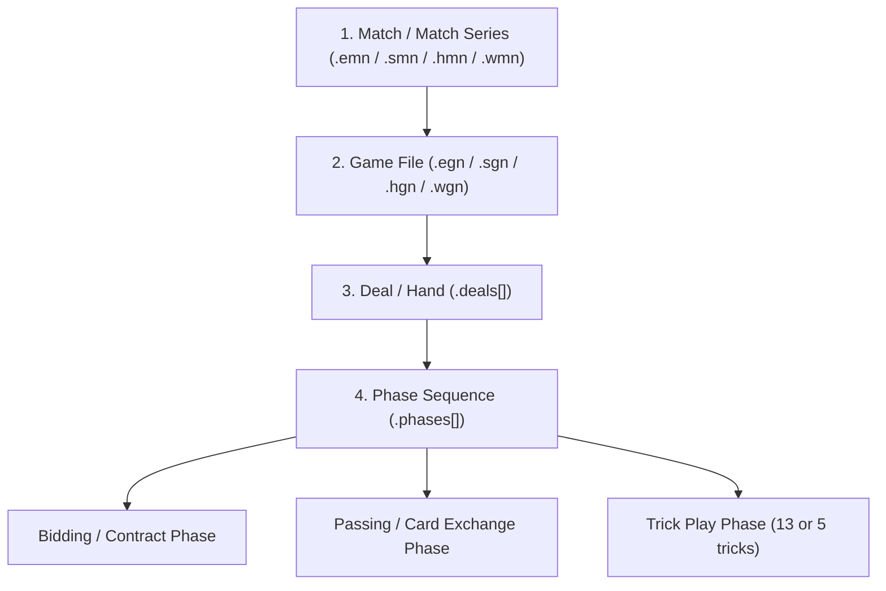
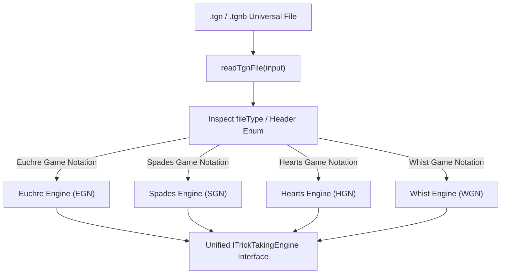
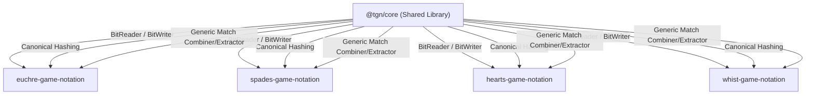

# Implementation Plan: Unified Trick-Taking Game Notations (SGN, HGN, WGN)

This document outlines the architectural implementation plan for creating standalone sibling repositories for **Spades Game Notation (`SGN`)**, **Hearts Game Notation (`HGN`)**, and **Whist Game Notation (`WGN`)**. 

All four specifications (Euchre, Spades, Hearts, Whist) adhere to the same overarching **deterministic minimalism philosophy** and unified `deals` / `phases` schema hierarchy, enabling shared parser design, bitpacker algorithms, and replay engine visualization.

> 📁 **See also:** [Phased Migration Plan](PHASED_MIGRATION_PLAN.md) for the step-by-step roadmap to extract `@tgn/core` and publish sibling game repositories.

---

## 🏛️ Core Architectural Philosophy

Across all trick-taking card games, the overarching game state lifecycle decomposes into four unified structural tiers:



### Shared Root Schema Contract
Every game notation file shares the exact top-level JSON structure:

```json
{
  "fileType": "Spades Game Notation", // or "Hearts Game Notation" / "Whist Game Notation"
  "version": "1.0",
  "metadata": {
    "gameId": "unique-uuid",
    "title": "Evening Game #1",
    "date": "2026-08-01T12:00:00Z",
    "players": ["Player A", "Player B", "Player C", "Player D"],
    "initialScore": [0, 0],
    "ruleset": {}
  },
  "deals": [
    {
      "dealNumber": 0,
      "initialState": {
        "dealer": 0,
        "upCard": null
      },
      "phases": []
    }
  ]
}
```

---

## ♠️ 1. Spades Game Notation (`SGN` / `.sgn` / `.sgnb`)

### Game Characteristics & Phase Mechanics
- **Deck**: 52-card standard deck (13 cards per player).
- **Players**: 4 players in 2 partnerships (or 4-player cutthroat variant).
- **Target Score**: Default 500 points (or 300 points in short games). Spades are always trump.

### Phase 1: `SPADES_BIDDING`
Players bid in sequence starting left of dealer.
```typescript
interface SpadesBiddingPhase {
  phaseNumber: 0;
  type: "SPADES_BIDDING";
  bids: Array<{
    playerIndex: number; // 0..3
    bid: number | "NIL" | "BLIND_NIL"; // 0..13, NIL, BLIND_NIL
  }>;
  annotations?: Record<string, string[]>;
}
```

### Phase 2: `TRICK_PLAY`
13 tricks per deal. Spades cannot be led until "broken" (or unless player has only Spades).
```typescript
interface SpadesPlayPhase {
  phaseNumber: 1;
  type: "TRICK_PLAY";
  tricks: Array<[string, string, string, string]>; // 13 tricks of 4 cards
  playAnnotations?: Record<string, string[]>;
}
```

### `SGN` Ruleset Schema
```typescript
interface SpadesRuleset {
  winning_score?: number; // Default: 500
  nil_score?: number; // Default: 100
  blind_nil_score?: number; // Default: 200
  bag_penalty_threshold?: number; // Default: 10 bags = -100 pts
  spades_must_be_broken?: boolean; // Default: true
  allow_blind_nil?: boolean; // Default: true
  cutthroat?: boolean; // Default: false (partnership)
}
```

### `SGN` Bitpacker Specification (`.sgnb`)
- 52 cards mapped to 6-bit card IDs (0..51).
- 4 player hands (13 cards * 6 bits = 78 bits per hand = 312 bits).
- 4 bids (4 bits per bid = 16 bits).
- 13 tricks (52 card plays * 6 bits = 312 bits).
- Total bitpacked deal size: **~80 - 90 bytes** (vs ~15-25 KB JSON).

---

## ♥️ 2. Hearts Game Notation (`HGN` / `.hgn` / `.hgnb`)

### Game Characteristics & Phase Mechanics
- **Deck**: 52-card standard deck (13 cards per player).
- **Players**: 4 individual players (evading trick points).
- **Target Loss Threshold**: Game ends when any player reaches 100 points (lowest score wins).

### Phase 1: `HEARTS_PASSING` (Optional depending on deal number)
Card rotation passing: Deal 1 (Left), Deal 2 (Right), Deal 3 (Across), Deal 4 (Keeper/No Pass).
```typescript
interface HeartsPassingPhase {
  phaseNumber: 0;
  type: "HEARTS_PASSING";
  direction: "LEFT" | "RIGHT" | "ACROSS" | "NONE";
  passes: Array<{
    fromPlayer: number; // 0..3
    toPlayer: number; // 0..3
    cards: [string, string, string]; // 3 cards passed
  }>;
}
```

### Phase 2: `TRICK_PLAY`
Player holding **2♣** leads the 1st trick. Hearts cannot be led until "broken".
```typescript
interface HeartsPlayPhase {
  phaseNumber: 1;
  type: "TRICK_PLAY";
  tricks: Array<[string, string, string, string]>; // 13 tricks of 4 cards
  playAnnotations?: Record<string, string[]>;
}
```

### `HGN` Ruleset Schema
```typescript
interface HeartsRuleset {
  loss_threshold_score?: number; // Default: 100 points
  queen_of_spades_penalty?: number; // Default: 13 points
  heart_penalty?: number; // Default: 1 point per heart
  shooting_moon_bonus?: "SUBTRACT_26_SELF" | "ADD_26_OTHERS";
  jack_of_diamonds_variant?: boolean; // Default: false (-10 points if captured)
  break_hearts_first?: boolean; // Default: true
}
```

---

## 🃏 3. Whist Game Notation (`WGN` / `.wgn` / `.wgnb`)

### Game Characteristics & Phase Mechanics
- **Deck**: 52-card standard deck (13 cards per player).
- **Players**: 4 players in 2 partnerships (Classic Whist) or 4 individual players (Solo Whist).

### Phase 1: `WHIST_BIDDING` (Solo Whist & Minnesota Whist) or Trump Determination (Classic Whist)
- **Classic Whist**: No bidding phase. The last card dealt to dealer is turned face up to establish the Trump Suit.
- **Solo Whist**: Bidding phase (Proposal, Acceptance, Solo, Misere, Abundance, Open Misere).
- **Minnesota Whist**: Bidding phase with **no trump suit ever played**. Players bid `"HIGH"` (Aces high, target 7+ tricks), `"LOW"` (Aces low, target minimizing tricks), or `"GRAND"`. If all pass, dealer's team plays Low.

```typescript
interface WhistBiddingPhase {
  phaseNumber: 0;
  type: "WHIST_BIDDING";
  bids: Array<{
    playerIndex: number;
    call: 
      | "PASS" 
      | "PROPOSE" | "ACCEPT" | "SOLO" | "MISERE" | "ABUNDANCE" | "OPEN_MISERE" // Solo Whist
      | "HIGH" | "LOW" | "GRAND"; // Minnesota Whist (No-Trump High/Low)
    trumpSuit?: "s" | "h" | "d" | "c" | "NT";
  }>;
}
```

### Phase 2: `TRICK_PLAY`
13 tricks per deal.
```typescript
interface WhistPlayPhase {
  phaseNumber: 1;
  type: "TRICK_PLAY";
  tricks: Array<[string, string, string, string]>;
}
```

### `WGN` Ruleset Schema
```typescript
interface WhistRuleset {
  variant?: "CLASSIC" | "SOLO" | "BIDDING_WHIST" | "MINNESOTA";
  winning_score?: number; // Default: 5 points (Short Whist), 10 points (Long Whist), or 13 points (Minnesota Whist)
  honours_scoring?: boolean; // Default: true for Classic Whist (A, K, Q, J of trump suit)
  aces_low_in_low_bids?: boolean; // Default: true for Minnesota Whist (Aces become lowest rank in LOW contracts)
  no_trump_mode?: boolean; // Default: true for Minnesota Whist
}
```

---

## 🌐 4. Universal `.tgn` / `.tgnb` Files & Polymorphic Dispatcher (`@tgn/core`)

To enable seamless multi-game storage and replaying across web apps, mobile clients, and databases, `@tgn/core` introduces the concept of a **Universal `.tgn` (JSON)** and **Universal `.tgnb` (Binary Protobuf)** file.

A `.tgn` file can store **any** supported trick-taking game (Euchre, Spades, Hearts, Whist). The parser inspects the root `fileType` property to dynamically select the appropriate game engine, schema validator, and bitpacker.



### Universal Reader Dispatcher Signature
```typescript
export type GameNotationType = 
  | "Euchre Game Notation"
  | "Spades Game Notation"
  | "Hearts Game Notation"
  | "Whist Game Notation";

export interface ParsedTgnFile<T = Record<string, unknown>> {
  fileType: GameNotationType;
  version: string;
  metadata: {
    gameId: string;
    players: string[];
    ruleset: Record<string, unknown>;
  };
  deals: Array<{
    dealNumber: number;
    initialState: Record<string, unknown>;
    phases: Array<{
      phaseNumber: number;
      type: string;
      [key: string]: unknown;
    }>;
  }>;
  engine: ITrickTakingEngine;
  parsedGameData: T;
}

/**
 * Polymorphic reader that inspects fileType or binary header byte
 * and automatically dispatches to the correct game notation parser.
 */
export function readTgnFile(input: string | Uint8Array): ParsedTgnFile;
```

### Shared Replayer Interface Contract
```typescript
export interface ITrickTakingEngine {
  loadGame(file: ParsedTgnFile): void;
  getGameType(): GameNotationType;
  getTrumpSuit(dealIndex: number): string | null;
  getTrickLeader(dealIndex: number, trickIndex: number): number;
  getTrickWinner(dealIndex: number, trickIndex: number): number;
  getDealScores(dealIndex: number): [number, number] | [number, number, number, number];
}
```

---

## 🔄 Shared Code & Shared Files Across Repositories

To avoid duplicating core algorithms across `euchre-game-notation`, `spades-game-notation`, `hearts-game-notation`, and `whist-game-notation`, common infrastructure will be extracted into a shared core library (`@tgn/core` or `trick-taking-core`) or shared directly across repositories:



### 📦 1. Identical Shared File Inventory

| Shared File Module | Purpose | Reusability Rate |
| :--- | :--- | :--- |
| **`src/bitstream.ts`** | `BitWriter` and `BitReader` for bitpacking integers, card indices, and boolean flags into binary streams. | **100% Identical** |
| **`src/hashing.ts`** | `stableStringify()` (recursive canonical key sorting) & SHA-256 baseline/full file hashing algorithms (`hashEgn`, `hashSgn`, etc.). | **100% Identical** |
| **`src/card-encoding.ts`** | Standard 52-card & 24-card suit (`s,h,d,c`) and rank parsing (`2..A`, `9..A`). | **100% Shared Utility** |
| **`src/match-combiner.ts`** | Generic match series combiner (`combineEgnToEmn`, `combineSgnToSmn`, etc.) handling `playersOverride` seat maps & format targets. | **95% Shared Code** |
| **`src/match-extractor.ts`** | Generic match series extractor with out-of-bounds index protection and master player name resolution. | **95% Shared Code** |
| **`generate-proto-schemas.js`** | Build script that converts JSON schema definitions to Protobuf `.proto` schemas (`npm run generate:proto-schemas`). | **100% Identical** |
| **`test/test-helpers.ts`** | Roundtrip test harness verifying JSON schema compliance, bitpacking, and Protobuf binary encoding. | **90% Shared Code** |

---

## 🚀 Repository Roadmap & Implementation Phases

| Repository | Scope | Primary Deliverables | Target Artifacts |
| :--- | :--- | :--- | :--- |
| **`@tgn/core`** | Shared Core Engine | `BitReader`, `BitWriter`, `stableStringify`, card parsers, generic match combiners | `npm install @tgn/core` |
| **`euchre-game-notation`** | Euchre (`.egn` / `.egnb`) | Core 24-card bitpacker, EMN match support, Protobuf schemas | `npm install euchre-game-notation` |
| **`spades-game-notation`** | Spades (`.sgn` / `.sgnb`) | 52-card 13-trick bitpacker, Nil/Blind Nil bidding validator | `npm install spades-game-notation` |
| **`hearts-game-notation`** | Hearts (`.hgn` / `.hgnb`) | 3-card passing phase bitpacker, Shoot the Moon scoring engine | `npm install hearts-game-notation` |
| **`whist-game-notation`** | Whist (`.wgn` / `.wgnb`) | Classic, Solo, & Minnesota Whist High/Low bidding | `npm install whist-game-notation` |

---

## 💡 Benefits of Shared Specification Architecture

1. **100% Code Reusability**: Replayer UIs, web servers, and mobile clients can render games across all 4 card games using a single unified canvas/react component library.
2. **Zero Code Duplication**: Extracting `@tgn/core` ensures `BitReader`, `BitWriter`, canonical hashing, and match combining bug fixes apply universally to all game notations simultaneously.
3. **Identical Storage Savings**: All 4 formats achieve **85-95% binary compression** via custom bitpacking and Protobuf schemas.
4. **Cross-Game Analytics**: Statistical engines (win probabilities, partner synergy, trick efficiency) operate on the same `deals` and `phases` abstraction layer regardless of game type.
